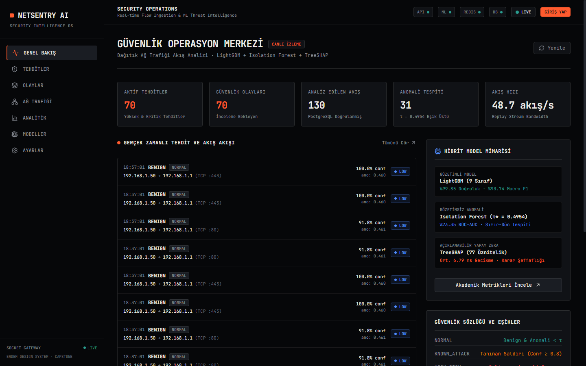
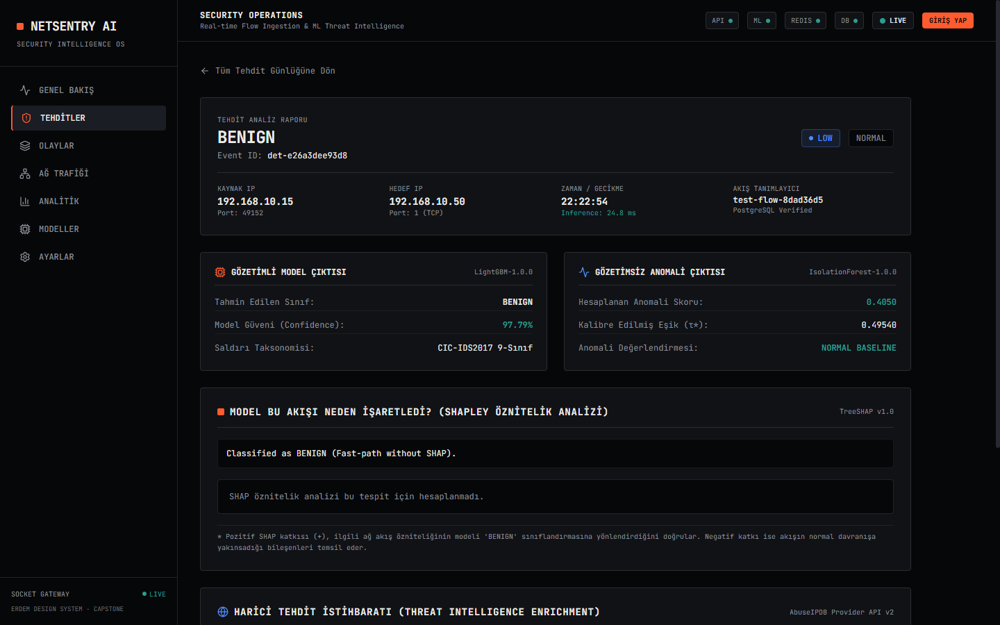
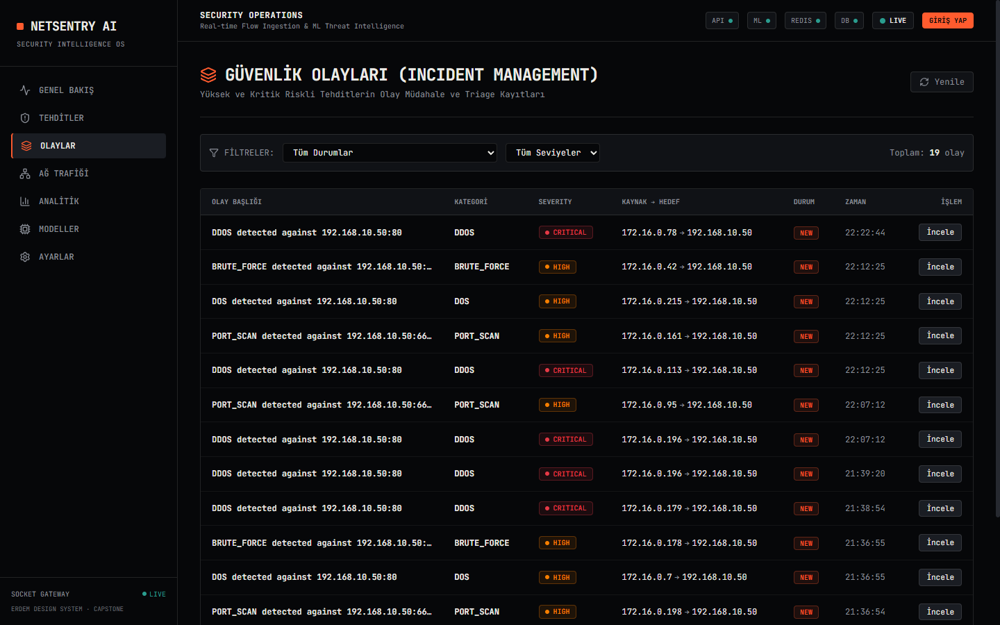
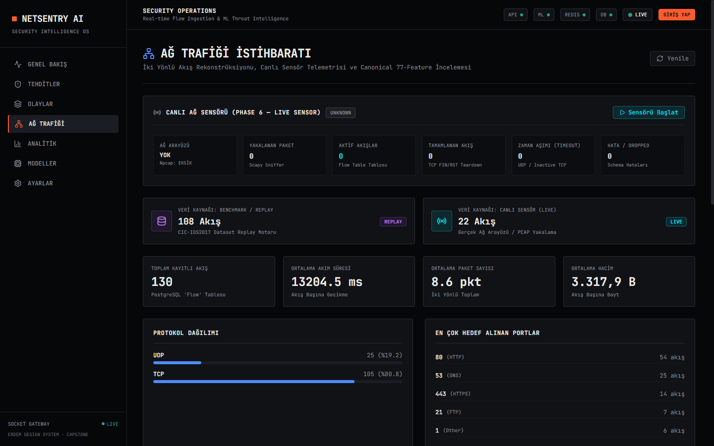
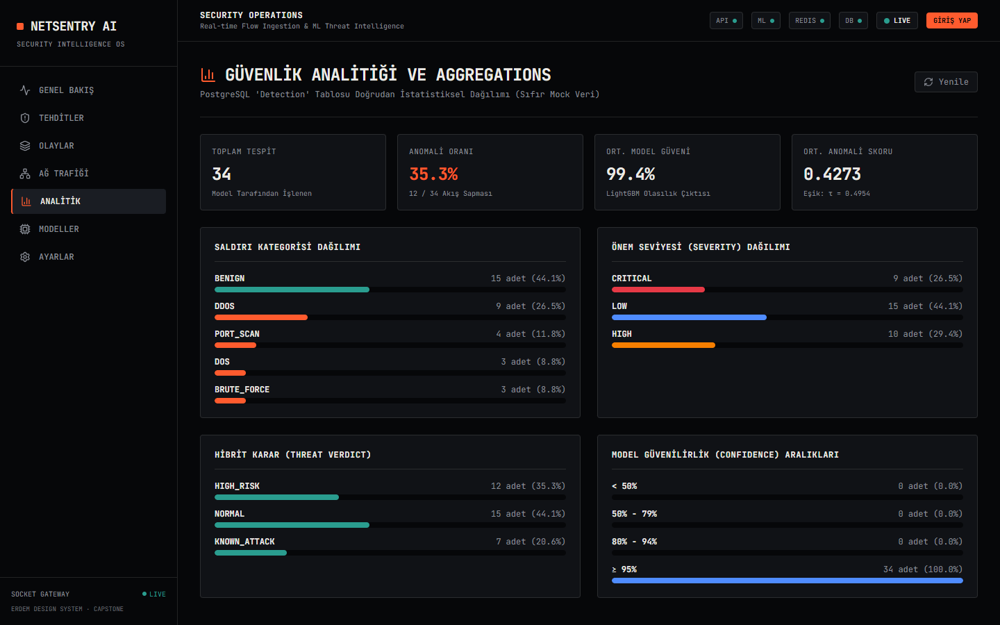
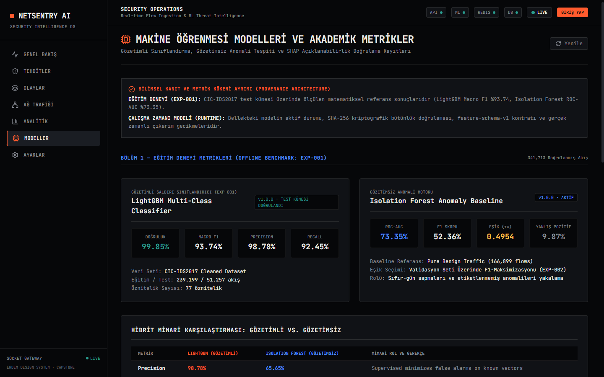
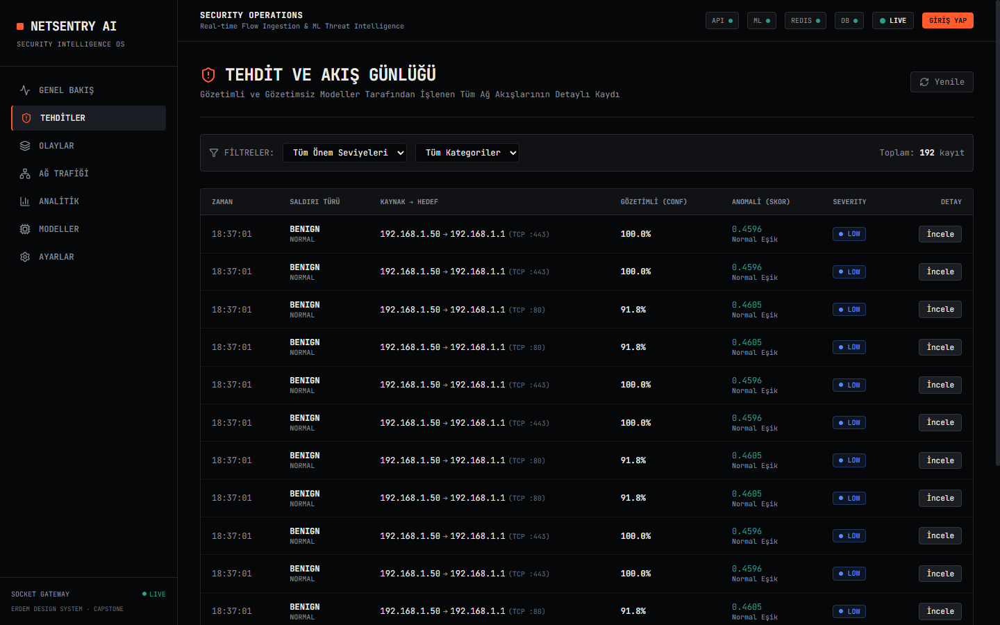
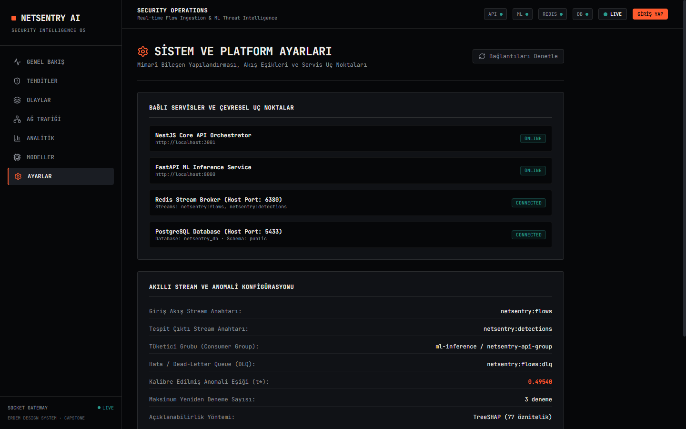
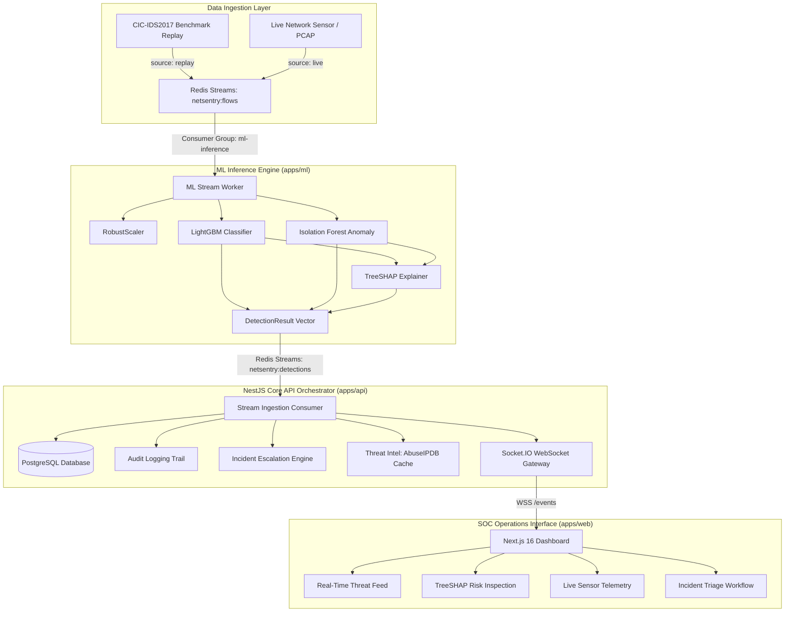

# NetSentry AI

### AI-Powered Network Intrusion Detection & Security Operations Platform

> **Real-time network flow analysis, hybrid anomaly detection, explainable AI, live packet sensing, and modern SOC operations.**

[](https://nextjs.org/)
[](https://nestjs.com/)
[](https://python.org/)
[](https://lightgbm.readthedocs.io/)
[](https://redis.io/)
[](https://postgresql.org/)
[](https://docker.com/)

---



---

## Project Description

**NetSentry AI** is an AI-assisted network intrusion detection and security operations platform that combines supervised classification, unsupervised anomaly detection, explainable AI, real-time stream processing, and live network sensing in a unified SOC environment.

It bridges the gap between static machine learning benchmarks and operational security workflows by coupling **supervised multi-class gradient boosting (LightGBM)** for known threat classification with **unsupervised isolation forests** for behavioral anomaly detection, **TreeSHAP** for transparent attribution, and a **real-time live network packet sensor** that reconstructs bidirectional conversation flows directly from network interfaces into canonical 77-feature vectors.

> **Türkçe Açıklama:** NetSentry AI; bilinen siber saldırıların tespiti için gözetimli sınıflandırmayı (LightGBM), bilinmeyen anomali ve sıfırıncı gün şüpheleri için gözetimsiz yoğunluk modelini (Isolation Forest), şeffaf karar gerekçeleri için TreeSHAP açıklanabilir yapay zekasını (XAI) ve gerçek ağ arayüzünden doğrudan paket yakalayarak 77 öznitelikli akış vektörleri üreten canlı ağ sensörünü tek bir modern SOC operasyon merkezinde birleştiren yapay zeka destekli ağ saldırı tespit ve güvenlik operasyonları platformudur.

---

## Screenshots

| Security Operations Center Overview | Threat Detail & TreeSHAP Attribution |
|:---:|:---:|
|  |  |

| Incident Management & Triage | Live Network Sensor (Phase 6) |
|:---:|:---:|
|  |  |

| Traffic Analytics & Attack Taxonomy | Model Intelligence & Integrity |
|:---:|:---:|
|  |  |

| Live Network Activity Feed | Security, Audit Logs & Telemetry |
|:---:|:---:|
|  |  |

---

## Why NetSentry?

- **Hybrid AI Detection:** Couples supervised LightGBM classification for known attack taxonomies with unsupervised Isolation Forest for behavioral deviation detection.
- **Explainable Predictions with TreeSHAP:** Solves the black-box AI dilemma in security by computing exact feature attributions for every alerted flow.
- **Real-Time Redis Stream Processing:** Asynchronous, decoupled ingestion pipeline ensuring backpressure resilience and low-latency detection.
- **Live Packet-to-Flow Sensing:** Captures raw Ethernet/IP frames and reassembles stateful bidirectional flows directly from network interfaces without modifying downstream inference models.
- **SOC Operations Dashboard:** Purpose-built SOC interface featuring real-time telemetry, automated incident escalation, and analyst triage workflows.
- **Threat Intelligence Enrichment:** Non-blocking AbuseIPDB reputation caching with strict SSRF controls for external validation.
- **Security Hardening and RBAC:** JWT authentication with HTTP-only cookies, role-based access control, cryptographic model integrity checks, and immutable PostgreSQL audit trails.

---

## Key Capabilities

1. **Dual Detection Engine:** Simultaneous supervised multi-class verdict (9 canonical attack families) and unsupervised anomaly score ($\tau^* = 0.49540$) per network conversation.
2. **Explainable AI (XAI):** Real-time TreeSHAP contributions expose top contributing features (e.g., `Bwd Packet Length Std`, `Packet Length Mean`, `Destination Port`) directly inside the analyst triage drawer.
3. **Microsecond Feature Extraction:** Extracts canonical 77-feature vectors conforming to `feature-schema-v1` in **0.1593 ms** per flow.
4. **Live & Replay Telemetry:** Operators can toggle between real network interface capture (`source: live`) and deterministic CIC-IDS2017 benchmark replay (`source: replay`).
5. **Zero-Mock Policy:** Every alert, chart point, incident status, and sensor counter is generated by active backend services and database records.

---

## Architecture



---

## Machine Learning

The detection pipeline combines supervised multi-class classification with unsupervised anomaly detection, trained and frozen on the **CIC-IDS2017** benchmark dataset:

- **Flow Volume:** 341,713 processed flows (70% Train: 239,199, 15% Validation: 51,257, 15% Test: 51,257).
- **100% Minority Retention:** Full representation of rare attack classes (`Heartbleed`, `Infiltration`, `Botnet`, `WebAttack`).
- **Zero Data Leakage:** Identifiers (`Source IP`, `Destination IP`, `Source Port`, `Timestamp`, `Flow ID`) are strictly excluded from the feature matrix. `RobustScaler` is fit exclusively on training data.
- **Canonical Feature Set:** Exactly 77 numerical features conforming to `feature-schema-v1`.
- **Calibrated Threshold:** Isolation Forest decision boundary calibrated via validation F1-optimization ($\tau^* = 0.49540$).

### Canonical Attack Taxonomy (9 Classes)

| Class | Type | Primary Threat Profile |
|---|---|---|
| `BENIGN` | Normal | Baseline legitimate enterprise network conversations |
| `DDoS` | Volumetric | High-rate distributed denial of service |
| `PortScan` | Recon | Network and port reconnaissance scanning |
| `DoS` | Denial | Slowloris, Slowhttptest, Hulk, GoldenEye application attacks |
| `BruteForce` | Access | FTP-Patator, SSH-Patator credential attacks |
| `Botnet` | C2 | Ares botnet command and control traffic |
| `WebAttack` | Exploit | SQL Injection, Cross-Site Scripting (XSS), Brute Force |
| `Infiltration` | Intrusion | Dropbox / privilege escalation lateral movement |
| `Heartbleed` | Memory | OpenSSL TLS Heartbeat memory disclosure vulnerability |

---

## Results

Empirical results evaluated on the held-out test split (51,257 flows):

| Model | Task | Metric | Result |
|---|---|---|:---:|
| **LightGBM** | Supervised Classification | **Accuracy** | **99.85%** |
| **LightGBM** | Supervised Classification | **Macro Precision** | **98.78%** |
| **LightGBM** | Supervised Classification | **Macro Recall** | **92.45%** |
| **LightGBM** | Supervised Classification | **Macro F1** | **93.74%** |
| **Isolation Forest** | Unsupervised Anomaly | **ROC-AUC** | **73.35%** |
| **Isolation Forest** | Unsupervised Anomaly | **Precision** | **65.65%** |
| **Isolation Forest** | Unsupervised Anomaly | **Recall** | **43.54%** |
| **Isolation Forest** | Unsupervised Anomaly | **F1 Score** | **52.36%** |
| **Isolation Forest** | Unsupervised Anomaly | **False Positive Rate** | **9.87%** |

> *Note on Evaluation Metrics:* In highly imbalanced network datasets, overall Accuracy (99.85%) is heavily influenced by the majority benign class. NetSentry AI evaluates model defensibility primarily on **Macro F1 (93.74%)** and minority recall to ensure rare exploits are accurately flagged.

---

## Real-Time Pipeline

The detection lifecycle processes network activity end-to-end through decoupled asynchronous stages:

```text
Live Sensor / Replay
        ↓
  Redis Streams (netsentry:flows)
        ↓
    ML Worker (LightGBM + Isolation Forest + TreeSHAP)
        ↓
  Redis Streams (netsentry:detections)
        ↓
   Core API (Persistence, Incident Rules, Threat Intel)
        ↓
   PostgreSQL (Immutable records & audit trail)
        ↓
 WebSocket Gateway (Socket.IO /events)
        ↓
   SOC Dashboard (Instant analyst notification)
```

1. **Ingestion:** Raw conversation records are published to `netsentry:flows` by the live network sensor or replay engine.
2. **Inference:** The Python ML Worker consumes flows via consumer groups, validates `feature-schema-v1`, evaluates models, and produces a `DetectionResult` with TreeSHAP attributions.
3. **Persistence & Escalation:** NestJS Core API consumes detections, persists them to PostgreSQL, updates risk metrics, and triggers incident triage if high severity is detected.
4. **Push Delivery:** The event is broadcast via Socket.IO `/events` to connected analyst dashboards within 40 ms.

---

## Live Network Sensor

NetSentry AI features a dedicated, driver-resilient **Live Network Sensor** (`apps/ml/app/sensor/`) capable of packet capture and real-time bidirectional flow reassembly without modifying existing pre-trained models.

```text
Network Interface
       ↓
 Packet Capture (Scapy / Npcap)
       ↓
Bidirectional Flow Reconstruction
       ↓
 77 Feature Extraction
       ↓
feature-schema-v1
       ↓
 Redis Streams
       ↓
Existing ML Pipeline
```

> **Reproducibility & Operational Parity:** Benchmark reproducibility is maintained through CIC-IDS2017 replay, while the live sensor provides operational network observation using the same downstream inference pipeline.

### Operational Characteristics

- **Stateful 5-Tuple Tracking:** Direction is established by the conversation initiator (`IP_src`, `IP_dst`, `Port_src`, `Port_dst`, `Protocol`). Reverse packets are correctly accounted as `Bwd` statistics.
- **Teardown & Eviction:** TCP connections terminate on FIN/RST flags; UDP flows terminate via configurable inactivity sweeps (default 30s via `NETSENTRY_FLOW_TIMEOUT_MS`) or lifetime limits (120s).
- **Driver Resiliency:** Gracefully detects Npcap on Windows; transitions to `SENSOR_UNAVAILABLE` with guidance if uninstalled, while offline PCAP stream ingestion operates driverless.
- **Privacy-by-Design:** **Zero raw payload retention**. Only L3/L4 header lengths, wire sizes, and protocol flags are analyzed.

---

## SOC Dashboard

The web interface (`apps/web`) is tailored for real-time security analysts:

- **Executive KPI Row:** Live incident counts, critical threat rate, average inference latency, and system health status.
- **Real-Time Threat Feed:** Live stream of inbound detections with source/destination addresses, protocol tags, severity badges, and classification verdicts.
- **TreeSHAP Risk Inspection Drawer:** Detailed breakdown of model confidence, anomaly score relative to threshold $\tau^*$, and top mathematical feature attributions explaining why the flow was flagged.
- **Incident Management:** Automatic and manual triage workflows, incident status transitions (`OPEN` $\to$ `INVESTIGATING` $\to$ `RESOLVED`), and severity ratings.
- **Live Network Telemetry Panel (`/network`):** Adapter discovery, capture toggle, active flow table counters, and real-time conversation monitor.
- **Model Intelligence Panel (`/models`):** Runtime model status, offline training benchmark comparison, and SHA-256 cryptographic verification status.
- **Settings & Audit Logs (`/settings`):** Live service health checks, RBAC role inspection, and comprehensive administrative audit log history.

---

## Security

NetSentry AI implements defense-in-depth security hardening across API, worker, and data layers:

- **Authentication & RBAC:** Secure JWT tokens stored in HTTP-only, SameSite cookies. Server-side `RolesGuard` restricts sensor start/stop and administrative resets to `ADMIN` accounts.
- **Cryptographic Model Verification:** All model artifacts (`LightGBM`, `Isolation Forest`, `TreeSHAP`, `RobustScaler`, `LabelEncoder`) undergo SHA-256 integrity validation upon service startup to prevent model tampering or deserialization exploits.
- **Schema Validation:** Strict `feature-schema-v1` checks ensure incoming flows have exactly 77 finite numerical values before reaching inference.
- **Service-to-Service Authentication:** Direct access to FastAPI sensor control endpoints (`/start`, `/stop`, `/process-pcap`) is blocked from public ingress and requires internal service token verification (`INTERNAL_SERVICE_TOKEN`).
- **Filesystem Sandboxing:** PCAP ingestion endpoints enforce canonical path boundaries within `NETSENTRY_PCAP_ROOT`, rejecting path traversals (`..`), symlink escapes, and arbitrary system file access.
- **Crash Recovery & DLQ:** Stream consumers leverage `XAUTOCLAIM` to automatically recover unacknowledged messages orphaned by crashed workers, with durable Redis-backed retry counters and dead-letter queue routing (`netsentry:flows:dlq`).
- **Ground-Truth Stream Isolation:** Ingestion pipelines guarantee that model input streams are strictly devoid of training labels, maintaining scientific isolation.
- **Privacy Protection:** No raw packet payload is captured, logged, or persisted to disk.
- **Audit Logging:** Administrative operations (`SENSOR_STARTED`, `SENSOR_STOPPED`, `SENSOR_PCAP_PROCESSED`, incident status changes, user logins) are written to an immutable PostgreSQL `AuditLog`.

---

## Threat Intelligence

The Threat Intelligence layer enriches detected public IP addresses via AbuseIPDB:

- **Provider Abstraction:** Modular `ThreatIntelProvider` interface supporting pluggable external threat feeds.
- **Redis Caching:** Validated lookups are cached in Redis with a 24-hour TTL to respect provider rate limits.
- **SSRF Mitigation:** A dedicated `SsrfValidator` blocks RFC 1918 private ranges (`10.0.0.0/8`, `172.16.0.0/12`, `192.168.0.0/16`), loopback addresses (`127.0.0.0/8`), link-local, and broadcast addresses from triggering external HTTP lookups.
- **Non-Blocking Enrichment:** Core detection and alerting execute immediately; external reputation score enrichment occurs asynchronously without blocking the event stream. If the provider is unavailable or quotas are exhausted, core detection continues uninterrupted without generating synthetic scores.

---

## Performance

### Controlled Workstation Benchmark Results

Empirical latency and throughput measurements under a controlled workstation test environment (`apps/ml/scripts/benchmark_sensor.py`):

| Metric | Measured Value | Operational Meaning |
|---|---|---|
| **Packet Ingestion Rate** | **17,207.9 pkts/sec** | High-throughput Layer 3/4 packet processing |
| **Flow Reconstruction Rate** | **2,458.3 flows/sec** | Concurrent bidirectional conversation reassembly |
| **Feature Extraction Latency (Mean)** | **0.1593 ms** (159.3 µs) | Per-flow compute cost to extract 77 statistical features |
| **Feature Extraction Latency (P50)** | **0.1437 ms** (143.7 µs) | Median feature extraction time |
| **Feature Extraction Latency (P95)** | **0.2480 ms** (248.0 µs) | Tail feature latency under 250 microseconds |
| **End-to-End Pipeline Latency (Mean)** | **39.64 ms** | Packet arrival $\to$ Flow Teardown $\to$ Redis $\to$ ML $\to$ Detections |
| **End-to-End Pipeline Latency (P95)** | **43.46 ms** | Real-time response within a single frame |

> *Note on Operational Scale:* These benchmarks were measured in a controlled evaluation environment on a single workstation instance. They demonstrate microsecond feature computation and low-latency streaming rather than multi-gigabit enterprise hardware appliance throughput.

---

## Limitations

- **Dataset Scope:** CIC-IDS2017 was collected in a controlled testbed environment and does not encompass all modern encrypted protocols or contemporary zero-day variants.
- **Rare Class Representation:** Minority classes like `Infiltration` have limited sample counts in the source dataset, resulting in lower recall compared to volumetric classes.
- **Anomaly False-Positive Rate:** Unsupervised Isolation Forest produces a ~9.87% false positive rate on diverse benign traffic, requiring human analyst confirmation.
- **External Threat Feed Quotas:** AbuseIPDB lookups depend on third-party API availability and daily query limits.
- **Prototype Scale:** The single-worker pipeline is optimized for prototype deployment and academic verification; it does not replace multi-gigabit enterprise SIEM or distributed IDS appliances.
- **Kernel Capture Dependency:** Promiscuous live network capture on Windows requires the host Npcap kernel driver; offline PCAP stream ingestion operates driverless.
- **No Zero-Day Guarantee:** While the dual detection engine surfaces behavioral outliers, it does not guarantee detection of all previously unseen evasive techniques.

---

## Quick Start

### Prerequisites

- [Docker Desktop](https://www.docker.com/) (PostgreSQL 16 & Redis 7)
- [Node.js](https://nodejs.org/) v20+ & npm
- [Python](https://www.python.org/) 3.12+
- *(Optional for Live Physical NIC Sniffing)*: [Npcap](https://npcap.com/) on Windows (install with *"WinPcap API-compatible mode"* enabled). Offline replay and PCAP analysis work driverless out-of-the-box.

---

### Default Credentials (RBAC)

The system is pre-configured with two distinct security roles implementing strict Role-Based Access Control:

| Role | Username / Email | Password | Scope & Permissions |
| :--- | :--- | :--- | :--- |
| **Yönetici (ADMIN)** | `admin@netsentry.ai` | `AdminPassword123!` | **Full Operational Access:** Sensor Start/Stop (`/api/v1/sensor`), Immutable Audit Logs (`/audit`), Demo Reset, Incident Escalation. |
| **Analist (ANALYST)** | `analyst@netsentry.ai` | `AnalystPassword123!` | **Analysis & Triage:** Threat Investigation (`/threats`), TreeSHAP Explanations, Incident Notes & Status Update, Sensor Monitoring. *(Sensor control & audit logs restricted with 403 Forbidden).* |

---

### One-Command Acceptance & Demo Harness

For jury presentation or automated evaluation, NetSentry AI includes a deterministic 8-stage verification harness:

```cmd
# 1. Replay Mode (Recommended for Jury Presentation):
# Validates health, resets demo state, replays 5 authentic attack classes,
# computes TreeSHAP explanations, verifies database persistence, and opens SOC Dashboard.
.\demo.cmd -Mode Replay -OpenBrowser

# 2. Live Sensor Mode (Physical Network Card Monitoring):
# Probes host NIC adapters via Npcap, executes live packet capture on active Wi-Fi/Ethernet,
# reconstructs bidirectional flows in real-time, and verifies pipeline telemetry.
.\demo.cmd -Mode LiveSensor -OpenBrowser
```

*(PowerShell alternative: `powershell -ExecutionPolicy Bypass -File .\tools\final-demo.ps1 -Mode Replay -OpenBrowser`)*

Automated verification generates both machine-readable and executive acceptance reports:
- **Executive Acceptance Summary:** [`reports/final-demo/latest.md`](reports/final-demo/latest.md)
- **Machine Verification Matrix:** [`reports/final-demo/latest.json`](reports/final-demo/latest.json)

---

### Manual Service Startup

If you prefer starting each service independently in separate terminals:

```bash
# 1. Clone & Infrastructure Setup
git clone https://github.com/ErdemYy/NetSentry.git
cd NetSentry
docker compose up -d postgres redis
cp .env.example .env

# Terminal 1: NestJS Core API (Port 3001)
cd apps/api
npm install
npm run build
npm run start

# Terminal 2: Python ML Engine & Stream Worker (Port 8000)
cd apps/ml
python -m venv .venv
.venv\Scripts\activate   # Linux/macOS: source .venv/bin/activate
pip install -r requirements.txt
python -m app.streaming.worker

# Terminal 3: Next.js SOC Dashboard (Port 3000)
cd apps/web
npm install
npm run build
npm run start
```

Navigate to **`http://localhost:3000`** in your browser.

---

## Presentation & Jury Flow

Follow this structured 5–10 minute workflow during defense:

1. **Executive Overview (`/`):** Review real-time KPI strip, dual-engine status (LightGBM + Isolation Forest), and live threat feed.
2. **Threat Investigation (`/threats`):** Examine ingested attack flows (DDoS, DoS, PortScan, BruteForce, Benign) classified with supervised confidence and unsupervised anomaly score.
3. **Explainable AI Attribution (`/threats/[id]`):** Open the **"WHY DID THE MODEL FLAG THIS?"** TreeSHAP panel to inspect exact micro-contributions per flow feature.
4. **Incident Escalation (`/incidents`):** Triage auto-escalated critical threats, update investigation state (`INVESTIGATING` $\to$ `RESOLVED`), and attach analyst notes.
5. **Live Network Sensor (`/network`):** Inspect discovered host adapters, Npcap driver availability, packet arrival counters, and active conversation reconstruction.
6. **Model Integrity (`/models`):** Verify runtime SHA-256 cryptographic hashes against training experiment baselines (`EXP-001`).
7. **Audit & Access Control (`/settings`):** Review immutable PostgreSQL audit trail and demonstrate role restrictions between `ADMIN` and `ANALYST`.

For the complete academic defense script, see the [Jury Presentation Script](docs/thesis/PRESENTATION_SCRIPT.md) and [Jury Technical Q&A Defense Guide](docs/thesis/JURY_QA.md).

---

## Repository Structure

```text
NetSentry/
├── apps/
│   ├── api/                 # NestJS Core API (Prisma, Auth, Audit, Socket.IO, Threat Intel)
│   ├── ml/                  # Python Engine (FastAPI, Sensor, Flow Reconstructor, ML Worker, Models)
│   │   ├── app/sensor/      # Live packet capture, flow table, 77-feature extraction
│   │   ├── app/streaming/   # Redis Streams consumer worker & replay engine
│   │   ├── models/          # Model artifacts & metadata contract
│   │   ├── scripts/         # Benchmark suite & verification scripts
│   │   └── tests/           # 35 Pytest unit, parity, and security tests
│   └── web/                 # Next.js 16 SOC Dashboard (Erdem Design System, Tailwind, Recharts)
├── packages/
│   └── shared/              # Shared TypeScript interfaces & detection contracts
├── docs/
│   ├── ARCHITECTURE.md      # Distributed architecture specifications
│   ├── DECISIONS.md         # 21 Architectural Decision Records (ADR-001 - ADR-021)
│   ├── DEMO.md              # Demonstration script & procedure
│   ├── EXPERIMENTS.md       # Empirical benchmark records (EXP-001 - EXP-006)
│   ├── ML-METHODOLOGY.md    # Machine learning training & feature pipeline
│   ├── THREAT-MODEL.md      # MITRE ATT&CK mapping & risk assessment matrix
│   ├── screenshots/         # High-resolution SOC dashboard screenshots
│   └── thesis/              # Complete academic thesis package (17 chapters)
├── docker-compose.yml       # Local infrastructure definition
└── README.md
```

---

## Thesis Documentation

The repository includes a comprehensive academic thesis package located in [`docs/thesis/`](docs/thesis/):

- [01. Abstract & Executive Summary](docs/thesis/ABSTRACT.md)
- [02. Problem Formulation](docs/thesis/PROBLEM.md)
- [03. Research Objectives](docs/thesis/OBJECTIVES.md)
- [04. System Architecture](docs/thesis/SYSTEM_ARCHITECTURE.md)
- [05. Dataset & Preprocessing](docs/thesis/DATASET_AND_PREPROCESSING.md)
- [06. Machine Learning Methodology](docs/thesis/MACHINE_LEARNING_METHODOLOGY.md)
- [07. Real-Time Stream Architecture](docs/thesis/REALTIME_ARCHITECTURE.md)
- [08. Live Network Sensor & Feature Extraction (Phase 6)](docs/thesis/LIVE_NETWORK_SENSOR.md)
- [09. Threat Intelligence Layer](docs/thesis/THREAT_INTELLIGENCE.md)
- [10. Security Architecture & Threat Model](docs/thesis/SECURITY_ARCHITECTURE.md)
- [11. Experimental Results & Latency Profiling](docs/thesis/EXPERIMENTAL_RESULTS.md)
- [12. Scientific Limitations](docs/thesis/LIMITATIONS.md)
- [13. Conclusion & Future Directions](docs/thesis/CONCLUSION.md)
- [14. Jury Defense Presentation Script](docs/thesis/PRESENTATION_SCRIPT.md)
- [15. Jury Q&A Technical Defense Guide](docs/thesis/JURY_QA.md)
- [16. Academic Defense Checklist](docs/thesis/DEFENSE_CHECKLIST.md)
- [17. Final System Validation Report](docs/thesis/FINAL_VALIDATION.md)

---

## Tech Stack

| Layer | Technologies |
|---|---|
| **Frontend** | Next.js 16.3 (Turbopack), React 19, Tailwind CSS, Lucide Icons, Recharts |
| **Core API** | NestJS 11, TypeScript 5.7, Prisma ORM, Socket.IO, Passport JWT, Helmet, Throttler |
| **Machine Learning** | Python 3.12, LightGBM 4.6, Scikit-learn 1.6, TreeSHAP 0.47, FastAPI, Pydantic |
| **Network Sensing** | Scapy 2.8, Npcap (Windows), Bidirectional Flow Key, Canonical 77-Feature Extractor |
| **Infrastructure** | PostgreSQL 16 (Alpine), Redis 7 (Alpine), Docker Compose |

---

## Author

**Erdem Yılmaz**  
GitHub: [@ErdemYy](https://github.com/ErdemYy)
